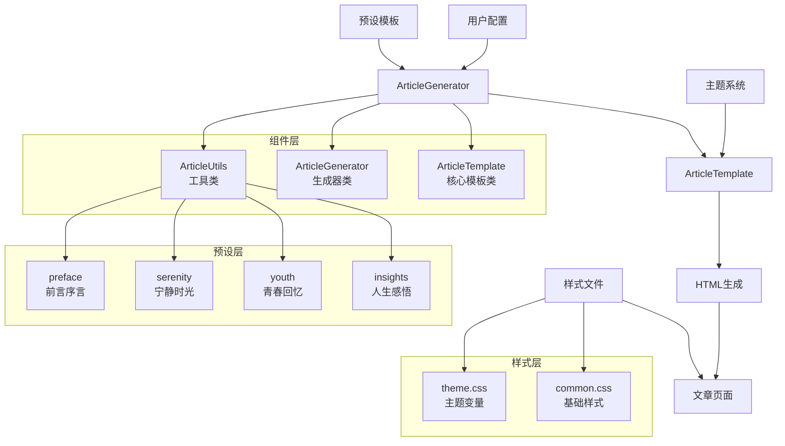
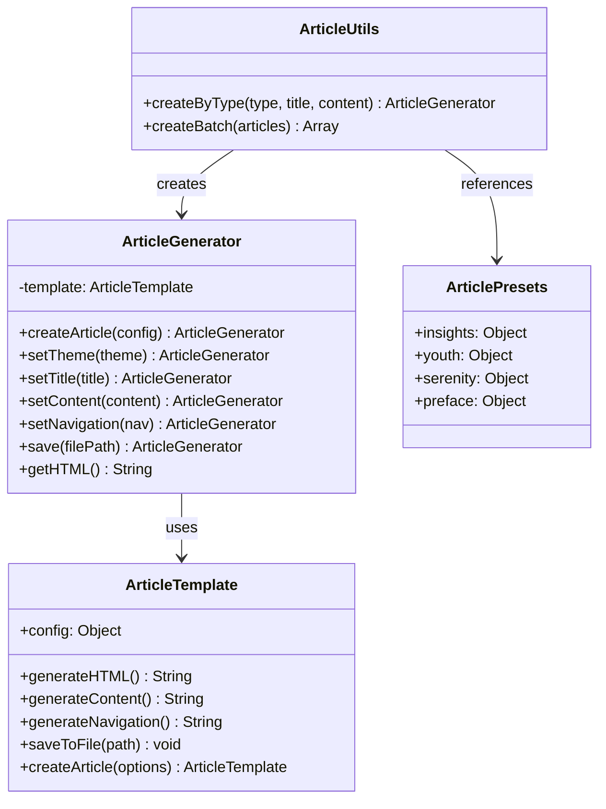
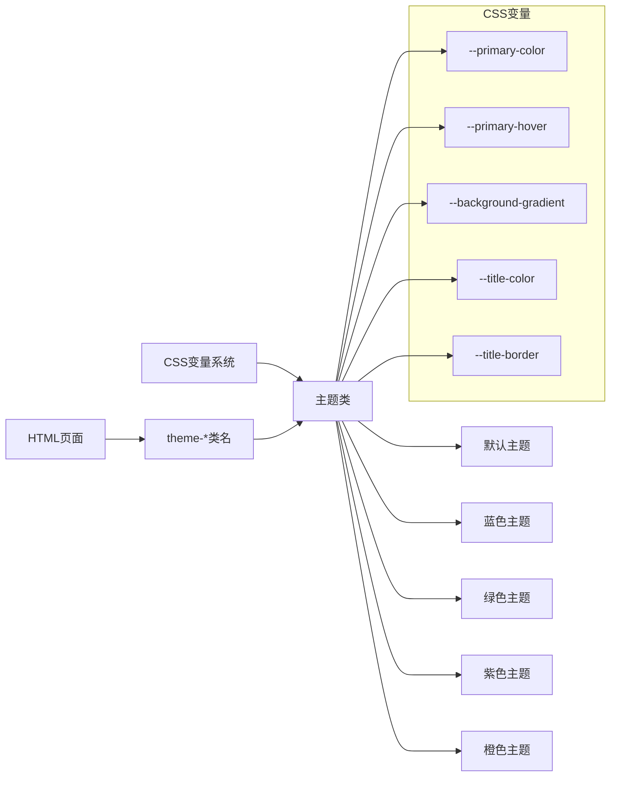
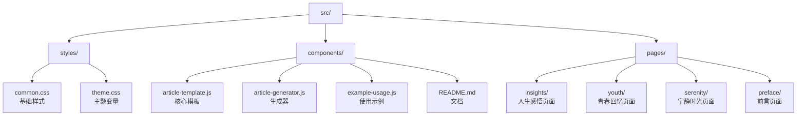
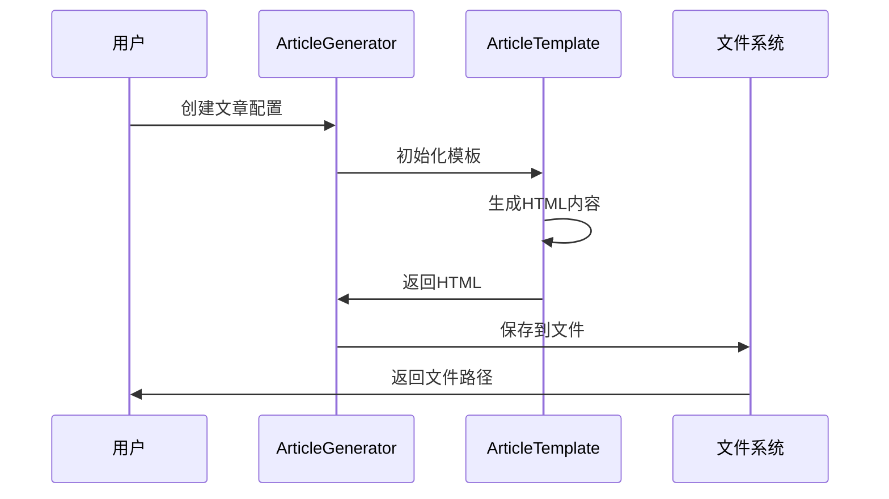

# 文章组件系统架构图

## 系统架构

## 组件关系图

## 主题系统架构

## 文件结构图

## 使用流程

## 扩展点

1. **新主题添加** - 在 `theme.css` 中添加新的主题类
2. **预设模板扩展** - 在 `ArticlePresets` 中添加新的文章类型
3. **自定义样式** - 通过 `customStyles` 参数添加额外样式
4. **组件功能扩展** - 在 `ArticleTemplate` 中添加新的生成方法
